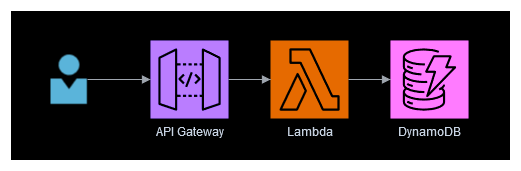

# Serverless Rest API Demo

## Overview
This package demonstrates a serverless architecture for a REST API using AWS services. The key components are API Gateway, Lambda, and DynamoDB. This approach offers several benefits in terms of scalability, cost-effectiveness, and ease of management compared to traditional server-based solutions.

## Architecture
1. **API Gateway**: API Gateway serves as the entry point for the REST API. It handes incomming HTTP requests, performs request validation, and routes the requests to the appropirate Lambda function.
1. **Lambda**: Lambda functions encasulate the business logic of the API. They handle the processing of requests and interacting witht he database or other services. Lambda's serverlss natrue ensures automatic scaling and elimiated the need for server management.
1. **DynamoDB**: DynamoDB is a fully managed NoSQL database. It is used to store and retreive data for the API.

    

**Applicaiton flow**
1. A clent makdes and HTTP request to the API Gateway endpoint.
1. API Gateway validates the request, performs any necessary transformations, and routes the request to the appropirate Lamba function.
1. the Lambda function process the request, interacts with the database to retrive, create, update or delete any data.
1. The Lambda function returns a response to API gateway.
1. API gateway send the response as an HTTP response to the client.

## Benefits
1. **Scalability**: The serverless nature of this architecture allows for automatic scaling to handle fluctuations in traffic without the need for manual infrastructure management.
1. **Cost-Effectiveness**: Billing is closly tied to actual usage. API gateway is billed based on requests handled, Lambda is billed based on compute time (at the millisecond level). There is no need to pay for idling resources on standby for requests.
1. **Reduced Operational Load**: With serverless components there is no need to manage and maintain servers, install software updates, or provision resources. This allows a team to focus on building and improving the application rather than managing infrastrucutre.
1. **High Availability**: The AWS services are designed with high availability and 
fault tolerance, providing a reliable platform without any additional effort.

